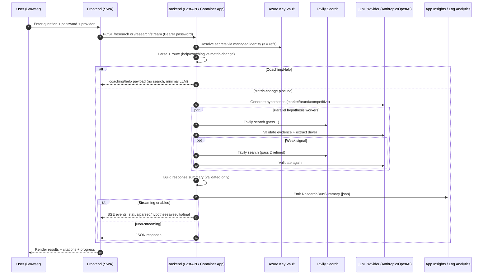

# Researcher – Architecture, Workflows, and Eval/Feedback System

> This document explains how **Researcher** works end-to-end (backend + frontend + Azure), how answers are formulated in Python, and how we evaluate quality across **Anthropic vs OpenAI**. Includes Mermaid diagrams for the two key workflows.

## 1) High-level Architecture

### Components
- **Frontend (React + Vite + Tailwind)**
  - Azure **Static Web Apps**
  - Chat UI with optional **SSE streaming** toggle
  - App-wide password gate (simple PLC auth)
  - Dashboard (telemetry)
  - (In progress) Eval page + feedback UI

- **Backend (FastAPI / Python)**
  - Azure **Container Apps**
  - **Managed Identity**
  - **Azure Key Vault** secret references only (no inline secrets)
  - Tavily web search
  - LLM calls (Anthropic + OpenAI) via a unified generator
  - Evidence-gated hypothesis pipeline
  - Observability via Application Insights (workspace-based) + Log Analytics queries

- **Data / Telemetry**
  - Workspace-based **Application Insights** backed by **Log Analytics**
  - Durable events written as structured JSON in AppTraces
  - Dashboard queries Kusto to list recent runs

### Security model
- **All secrets** live in **Azure Key Vault**
- Container App uses **system-assigned managed identity**
- Container App secrets are set as **Key Vault references** (`keyvaultref:...,identityref:system`)
- Backend enforces an **app password** via middleware:
  - All endpoints except `/health` require `Authorization: Bearer <password>`

## 2) Answer Formulation: How Python Produces an Answer

The backend is designed to *avoid hallucinations* by using an **evidence-gated** process:

1) **Parse user question** into a structured request
2) **Route**: metric-change pipeline vs coaching/help
3) **Generate hypotheses** (market / brand / competitive)
4) For each hypothesis:
   - Form search queries
   - Run **Tavily search**
   - Validate evidence against the hypothesis
   - Keep only *validated* drivers
5) Build a structured response:
   - Summary drivers
   - Citations
   - Optional competitor section messaging if empty
6) Emit telemetry

### Unified LLM provider abstraction
A single function (conceptually `llm_generate(...)`) routes prompts to either:
- Anthropic (Claude)
- OpenAI (GPT)

The frontend provider toggle controls which provider the backend uses.

### Evidence gating
Drivers are only included if:
- there are supporting sources
- the validation step marks them as supported (vs speculative)

### Second-pass search (Option A)
If the first search pass returns weak/insufficient evidence:
- run a targeted, refined 2nd-pass query
- cap the number of 2nd-pass searches for cost/latency control

## 3) Workflow #1 – Research (Chat) Run



### What the UI shows
- Assistant message with provider badge
- Driver sections:
  - Market
  - Brand
  - Competitive
- Evidence links
- Optional “no validated competitor drivers” messaging

## 4) Workflow #2 – Eval + Feedback Loop

There are two related loops:
- **Eval harness** (batch comparisons across providers)
- **User feedback** (thumbs up/down on any response)

```mermaid
flowchart TD
  A[Eval Questions (hardcoded set in repo)] --> B[Run Eval]
  B --> C{Provider}
  C -->|Anthropic| D[POST /research (provider=anthropic)]
  C -->|OpenAI| E[POST /research (provider=openai)]
  D --> F[Score response heuristics]
  E --> F
  F --> G[Emit EvalRun event to Log Analytics]
  G --> H[Eval Portal UI shows side-by-side + scores]

  H --> I[SME/User thumbs up/down]
  I -->|👍| J[POST /feedback rating=+1]
  I -->|👎 + comment| K[POST /feedback rating=-1 + comment]
  J --> L[Emit UserFeedback event]
  K --> L
  L --> M[Dashboard / export for prompt tuning]
```

### Eval question set
For MVP we keep a fixed list of ~10 questions (versioned in git). Benefits:
- repeatable regression testing
- easy comparisons over time

### Scoring philosophy (practical + repeatable)
We score what we can measure consistently:
- citations present and count
- number of validated drivers
- coverage across sections (market/brand/competitive)
- unique domains
- latency/tokens/search counts (cost + performance)

This is not perfect “truth scoring” — but it quickly reveals:
- which provider is more useful
- regressions after prompt or logic changes
- whether outputs are consistently empty or citation-poor

## 5) Observability / Telemetry

### What we log
Durable JSON events are written to AppTraces with a prefix or `kind` field:
- `ResearchRunSummary` (already implemented)
- `EvalRun` (implemented)
- `UserFeedback` (implemented)

### Why Log Analytics
- survives container scale-to-zero
- centralizes events across replicas
- supports Kusto queries for dashboards and exports

## 6) How this becomes “SME tester ready”

Checklist:
- Eval page: run 10 questions × 2 providers reliably
- Show side-by-side output + scorecard
- Thumbs feedback works on mobile
- Dashboard shows:
  - recent runs
  - eval runs
  - feedback stream
- Export to CSV/JSON
- Clear error handling (no “stuck refreshing”)

## 7) Repo pointers
- Backend main: `backend/main.py`
- Frontend chat UI: `frontend/src/components/ChatInterface.tsx`
- Eval question set: `backend/eval_questions.json`
- Plan doc: `EVAL_AND_FEEDBACK_PLAN.md`

---

If you want, next iteration of this doc can include:
- exact payload schemas for `/research`, `/research/stream`, `/eval/run`, `/feedback`
- the Kusto queries used by dashboard panels
- a prompt pack appendix (hypothesis generation + evidence validation prompts)
