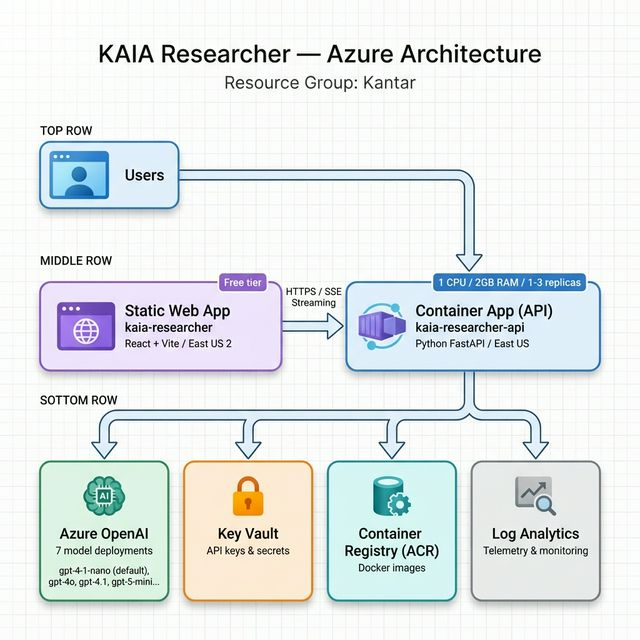

# KAIA Researcher — Deployment Guide

**Last Updated:** 2026-02-13  
**Current Backend Version:** v20  
**Resource Group:** `Kantar`  
**Region:** East US (primary), East US 2 (SWA)

---

## Table of Contents

1. [Architecture Overview](#1-architecture-overview)
2. [Prerequisites](#2-prerequisites)
3. [Infrastructure (Bicep)](#3-infrastructure-bicep)
4. [Backend Deployment](#4-backend-deployment)
5. [Frontend Deployment](#5-frontend-deployment)
6. [Environment Variables](#6-environment-variables)
7. [OpenAI Model Deployments](#7-openai-model-deployments)
8. [Quick Reference](#8-quick-reference)
9. [Troubleshooting](#9-troubleshooting)

---

## 1. Architecture Overview

```
┌──────────────────────────────────────────────────────────────────┐
│                        Resource Group: Kantar                    │
└──────────────────────────────────────────────────────────────────┘
```



**Resource Inventory:**

| Resource | Type | Name | Location |
|----------|------|------|----------|
| Frontend | Static Web App | `kaia-researcher` | East US 2 |
| Backend API | Container App | `kaia-researcher-api` | East US |
| Container Registry | ACR | `kaiaresearcherkrn5bz` | East US |
| OpenAI | Cognitive Services | `kaia-researcher-openai` | East US |
| Key Vault | Key Vault | `kaia-researcher-kvkrn5bz` | East US |
| Log Analytics | Workspace | `kaia-researcher-law` | East US |
| Container Env | Managed Environment | `kaia-researcher-env` | East US |

---

## 2. Prerequisites

```bash
# Required tools
brew install azure-cli
npm install -g @azure/static-web-apps-cli

# Docker Desktop (for building container images)
# Node.js 18+ (for frontend build)

# Azure login
az login
az account set --subscription "<YOUR_SUBSCRIPTION_ID>"
```

---

## 3. Infrastructure (Bicep)

Infrastructure is defined in `infra/main.bicep`. To deploy:

```bash
# Preview changes
az deployment group what-if \
  --resource-group Kantar \
  --template-file infra/main.bicep \
  --parameters infra/main.bicepparam

# Deploy
az deployment group create \
  --resource-group Kantar \
  --template-file infra/main.bicep \
  --parameters infra/main.bicepparam
```

See [infra/main.bicep](./infra/main.bicep) for the full template.

---

## 4. Backend Deployment

### Build & Push Container

```bash
# From repo root — increment version tag each deploy
VERSION=v17

# Build for linux/amd64 (required for Azure Container Apps)
docker build --platform linux/amd64 \
  -t kaiaresearcherkrn5bz.azurecr.io/kaia-researcher-api:${VERSION} \
  -f backend/Dockerfile backend

# Push to ACR
docker push kaiaresearcherkrn5bz.azurecr.io/kaia-researcher-api:${VERSION}
```

### Update Container App

```bash
az containerapp update \
  --name kaia-researcher-api \
  --resource-group Kantar \
  --image kaiaresearcherkrn5bz.azurecr.io/kaia-researcher-api:${VERSION}
```

### Verify

```bash
# Check health
curl -s https://kaia-researcher-api.icyglacier-f068d1b2.eastus.azurecontainerapps.io/health

# Check deployed image
az containerapp show --name kaia-researcher-api --resource-group Kantar \
  --query "properties.template.containers[0].image" -o tsv

# Check sources endpoint
curl -s https://kaia-researcher-api.icyglacier-f068d1b2.eastus.azurecontainerapps.io/sources \
  -H "Authorization: Bearer KantarResearch" | python3 -m json.tool | head -10
```

---

## 5. Frontend Deployment

### Build

```bash
cd frontend
npm run build   # outputs to dist/
```

### Deploy to SWA

```bash
# Get deployment token
SWA_TOKEN=$(az staticwebapp secrets list \
  --name kaia-researcher \
  --query "properties.apiKey" -o tsv)

# Deploy
npx @azure/static-web-apps-cli deploy ./dist \
  --deployment-token "$SWA_TOKEN"
```

### Verify

```
https://delightful-glacier-01802140f.4.azurestaticapps.net
```

---

## 6. Environment Variables

These are set on the Container App:

| Variable | Description | Source |
|----------|-------------|--------|
| `AZURE_OPENAI_ENDPOINT` | Azure OpenAI endpoint URL | Key Vault |
| `AZURE_OPENAI_API_VERSION` | API version (e.g. `2025-03-01-preview`) | Direct |
| `OPENAI_API_KEY` | Azure OpenAI API key | Key Vault |
| `OPENAI_SEARCH_MODEL` | Default model for web search (e.g. `gpt-4-1-nano`) | Direct |
| `OPENAI_MODEL` | Default model for non-search LLM calls | Direct |
| `LOG_ANALYTICS_WORKSPACE_ID` | Log Analytics workspace ID | Direct |
| `ANTHROPIC_API_KEY` | Anthropic API key (optional) | Key Vault |

### Update environment variables

```bash
az containerapp update \
  --name kaia-researcher-api \
  --resource-group Kantar \
  --set-env-vars "OPENAI_SEARCH_MODEL=gpt-4-1-nano" "OPENAI_MODEL=gpt-4o-mini"
```

---

## 7. OpenAI Model Deployments

| Deployment Name | Model | Version | SKU | Capacity |
|----------------|-------|---------|-----|----------|
| `gpt-4o` | gpt-4o | 2024-08-06 | Standard | 80 |
| `gpt-4o-latest` | gpt-4o | 2024-11-20 | Standard | 70 |
| `gpt-4-1` | gpt-4.1 | 2025-04-14 | Standard | 50 |
| `gpt-4-1-mini` | gpt-4.1-mini | 2025-04-14 | Standard | 50 |
| `gpt-4-1-nano` | gpt-4.1-nano | 2025-04-14 | GlobalStandard | 50 |
| `gpt-5-mini` | gpt-5-mini | 2025-08-07 | GlobalStandard | 50 |
| `gpt-5-nano` | gpt-5-nano | 2025-08-07 | GlobalStandard | 50 |

### Add a new model deployment

```bash
az cognitiveservices account deployment create \
  --name kaia-researcher-openai \
  --resource-group Kantar \
  --deployment-name <DEPLOYMENT_NAME> \
  --model-name <MODEL_NAME> \
  --model-version <VERSION> \
  --model-format OpenAI \
  --sku-name Standard \
  --sku-capacity 50
```

---

## 8. Quick Reference

### Full Backend Release (build + push + deploy)

```bash
# One-liner: increment VERSION and run
VERSION=v21 && \
docker build --platform linux/amd64 \
  -t kaiaresearcherkrn5bz.azurecr.io/kaia-researcher-api:${VERSION} \
  -f backend/Dockerfile backend && \
docker push kaiaresearcherkrn5bz.azurecr.io/kaia-researcher-api:${VERSION} && \
az containerapp update \
  --name kaia-researcher-api \
  --resource-group Kantar \
  --image kaiaresearcherkrn5bz.azurecr.io/kaia-researcher-api:${VERSION}
```

### Full Frontend Release (build + deploy)

```bash
cd frontend && npm run build && \
SWA_TOKEN=$(az staticwebapp secrets list --name kaia-researcher --query "properties.apiKey" -o tsv) && \
npx @azure/static-web-apps-cli deploy ./dist --deployment-token "$SWA_TOKEN"
```

### URLs

| Service | URL |
|---------|-----|
| Frontend | `https://delightful-glacier-01802140f.4.azurestaticapps.net` |
| Backend API | `https://kaia-researcher-api.icyglacier-f068d1b2.eastus.azurecontainerapps.io` |
| Health Check | `https://kaia-researcher-api.icyglacier-f068d1b2.eastus.azurecontainerapps.io/health` |

---

## 9. Troubleshooting

### Container App not starting
```bash
# Check logs
az containerapp logs show --name kaia-researcher-api --resource-group Kantar --type system
az containerapp logs show --name kaia-researcher-api --resource-group Kantar --type console
```

### Cold starts (30s+ latency on first request)
- Container App is set to `minReplicas: 1` to avoid cold starts
- If experiencing cold starts, verify: `az containerapp show --name kaia-researcher-api --resource-group Kantar --query "properties.template.scale"`

### CORS errors
- CORS origins are configured in `backend/main.py` — add new frontend domains there
- Current allowed origins: `delightful-glacier-01802140f.4.azurestaticapps.net`, `localhost:5173`

### ACR authentication
```bash
# Login to ACR
az acr login --name kaiaresearcherkrn5bz

# Verify images
az acr repository list --name kaiaresearcherkrn5bz -o table
az acr repository show-tags --name kaiaresearcherkrn5bz --repository kaia-researcher-api -o table
```

---

## Deployment History

| Version | Date | Changes |
|---------|------|---------|
| v14 | 2026-02-13 | Dual-query search, per-request model selection, temperature fix |
| v15 | 2026-02-13 | Added gpt-4-1-mini, gpt-4-1-nano, gpt-5-nano deployments |
| v16 | 2026-02-13 | Set default to gpt-4-1-nano, updated model descriptions |
| v17 | 2026-02-13 | Trusted sources, social media filtering, no-inference rule, executive summary |
| v18 | 2026-02-13 | Targeted search pass (site: operators), telemetry fix, exec summary dedup, PDF export |
| v19 | 2026-02-13 | Industry-agnostic hypotheses, relevance filter, telemetry fallback fix, hypothesis prompt tab |
| v20 | 2026-02-13 | Server-side config storage, relevance filter safeguard, PDF export fix, default system prompt de-biased |
